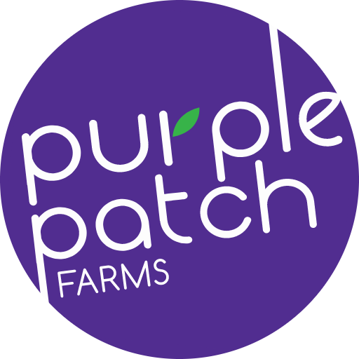

# 🍇 Purple Patch Farms - Cost Allocation Dashboard

A comprehensive, professional cost allocation system for fruit and vegetable farming operations, built with FastAPI and modern web technologies.



## ✨ Features

### 🎯 Core Functionality
- **Product Management**: Track inhouse and outsourced products with detailed categorization
- **Sales Tracking**: Monthly sales data with comprehensive revenue calculations
- **Cost Management**: Advanced cost tracking with multiple allocation methods
- **Smart Allocation**: Automatic cost distribution based on weight, value, or trips
- **Real-time Analytics**: Live dashboard with interactive charts and insights
- **Export Functionality**: Generate detailed CSV reports for any month
- **Database Reset**: Complete data reset functionality for testing

### 🎨 Professional UI
- **Modern Design**: Clean, professional interface with Purple Patch Farms branding
- **Collapsible Sidebar**: Space-efficient navigation with smooth animations
- **Responsive Layout**: Works perfectly on desktop and mobile devices
- **Interactive Charts**: Beautiful visualizations using Chart.js
- **Professional Typography**: Inter font family for modern, clean text

## 🚀 Quick Start

### Prerequisites
- Python 3.8 or higher
- pip (Python package manager)

### Installation

1. **Clone the Repository**:
   ```bash
   git clone https://github.com/Zubair121Md/Purple-patch-Farms.git
   cd Purple-patch-Farms
   ```

2. **Install Dependencies**:
   ```bash
   cd backend
   pip install -r requirements.txt
   ```

3. **Run the Application**:
   ```bash
   python app.py
   ```

4. **Access the Dashboard**:
   - Open your browser and go to `http://localhost:8000`
   - API documentation available at `http://localhost:8000/api/docs`

## 📁 Project Structure

```
Purple-patch-Farms/
├── backend/
│   ├── app.py                    # Main FastAPI application
│   ├── index.html               # Professional frontend dashboard
│   ├── requirements.txt         # Python dependencies
│   └── static/
│       ├── js/
│       │   └── dashboard.js     # Frontend JavaScript with full functionality
│       ├── images/
│       │   └── PP.jpg          # Company logo
│       └── exports/             # Generated reports
├── frontend/                    # Alternative frontend (if needed)
├── PP.jpg                      # Company logo
├── .gitignore                  # Git ignore file
└── README.md                   # This file
```

## 🔌 API Endpoints

### Products Management
- `GET /api/products` - List all products
- `POST /api/products` - Create new product
- `PUT /api/products/{id}` - Update product
- `DELETE /api/products/{id}` - Delete product

### Sales Tracking
- `GET /api/monthly-sales` - List all sales records
- `POST /api/monthly-sales` - Create new sales record
- `GET /api/monthly-sales/{month}` - Get sales by specific month
- `PUT /api/monthly-sales/{id}` - Update sales record
- `DELETE /api/monthly-sales/{id}` - Delete sales record

### Cost Management
- `GET /api/costs` - List all costs
- `POST /api/costs` - Create new cost entry
- `GET /api/costs/{month}` - Get costs by specific month
- `PUT /api/costs/{id}` - Update cost entry
- `DELETE /api/costs/{id}` - Delete cost entry

### Dashboard & Analytics
- `GET /api/dashboard/stats` - Get comprehensive dashboard statistics
- `GET /api/allocate/{month}` - Get detailed cost allocation for specific month
- `GET /api/export/{month}/csv` - Export monthly report as CSV
- `POST /api/reset-database` - Reset entire database (for testing)

## 🧮 Cost Allocation Logic

The system uses sophisticated algorithms to automatically allocate costs based on:

### 1. Product Source Classification
- **Inhouse**: Products grown on your own farm
- **Outsourced**: Products purchased from external suppliers

### 2. Cost Type Categories
- `purchase-only`: Costs that only apply to outsourced products
- `sales-only`: Costs related to sales and distribution activities
- `common`: Shared costs between inhouse and outsourced products
- `inhouse-only`: Costs specific to inhouse production

### 3. Allocation Methods
- **Weight-based**: Allocate costs based on product weight
- **Value-based**: Allocate costs based on product value
- **Trip-based**: Allocate costs based on number of trips

### 4. Cost Categories
- Market fees, electricity, staff salaries
- Distribution charges across multiple cities
- Repair & maintenance costs
- Transportation and logistics
- Marketing and miscellaneous expenses

## 🛠️ Technologies Used

### Backend
- **FastAPI**: Modern, fast web framework for building APIs
- **SQLAlchemy**: Powerful ORM for database operations
- **SQLite**: Lightweight, serverless database
- **Pydantic**: Data validation and serialization

### Frontend
- **HTML5 & CSS3**: Modern web standards
- **JavaScript (ES6+)**: Interactive functionality
- **Chart.js**: Beautiful, responsive charts
- **Font Awesome**: Professional icons
- **Inter Font**: Modern typography

### Development Tools
- **Git**: Version control
- **GitHub**: Code repository and collaboration
- **Python 3.8+**: Programming language

## 📊 Dashboard Features

### Main Dashboard
- **Key Metrics**: Total products, revenue, costs, and profit
- **Interactive Charts**: Revenue vs costs, source distribution
- **Real-time Updates**: Live data refresh functionality
- **Professional Design**: Clean, modern interface

### Navigation
- **Collapsible Sidebar**: Space-efficient navigation
- **Tab-based Interface**: Easy switching between sections
- **Professional Branding**: Purple Patch Farms logo and colors

### Data Management
- **CRUD Operations**: Full create, read, update, delete functionality
- **Form Validation**: Client and server-side validation
- **Error Handling**: Comprehensive error management
- **Success Notifications**: User-friendly feedback

## 🔧 Development

### Adding New Features

1. **Backend Changes**: Modify `backend/app.py`
2. **Frontend Changes**: Update `backend/index.html` and `backend/static/js/dashboard.js`
3. **Testing**: Run the application and test your changes

### Database Schema

#### Products Table
- `id`: Primary key
- `name`: Product name
- `source`: 'inhouse' or 'outsourced'
- `unit`: Measurement unit (default: 'kg')
- `extra_info`: Additional product information

#### Monthly Sales Table
- `id`: Primary key
- `product_id`: Foreign key to products
- `quantity`: Sales quantity
- `sale_price`: Price per unit
- `direct_cost`: Direct cost per unit
- `month`: Sales month (YYYY-MM format)

#### Costs Table
- `id`: Primary key
- `name`: Cost description
- `amount`: Cost amount
- `applies_to`: 'inhouse', 'outsourced', 'both', or 'all'
- `cost_type`: 'purchase-only', 'sales-only', 'common', or 'inhouse-only'
- `basis`: 'weight', 'value', or 'trips'
- `month`: Cost month (YYYY-MM format)
- `is_fixed`: 'fixed' or 'variable'
- `category`: Cost category

## 📈 Usage Examples

### Adding a New Product
```json
{
  "name": "Organic Tomatoes",
  "source": "inhouse",
  "unit": "kg",
  "extra_info": "Premium organic tomatoes"
}
```

### Recording Sales
```json
{
  "product_id": 1,
  "quantity": 100.5,
  "sale_price": 45.50,
  "direct_cost": 25.00,
  "month": "2024-04"
}
```

### Adding Costs
```json
{
  "name": "Electricity Bill",
  "amount": 5000.00,
  "applies_to": "all",
  "cost_type": "common",
  "basis": "value",
  "month": "2024-04",
  "is_fixed": "variable",
  "category": "utilities"
}
```

## 🤝 Contributing

1. Fork the repository
2. Create a feature branch (`git checkout -b feature/amazing-feature`)
3. Commit your changes (`git commit -m 'Add some amazing feature'`)
4. Push to the branch (`git push origin feature/amazing-feature`)
5. Open a Pull Request

## 📝 License

This project is proprietary to Purple Patch Farms. All rights reserved.

## 📞 Support

For support and questions, please contact the development team or create an issue in the GitHub repository.

---

**Purple Patch Farms** - Growing Excellence, One Harvest at a Time 🌱